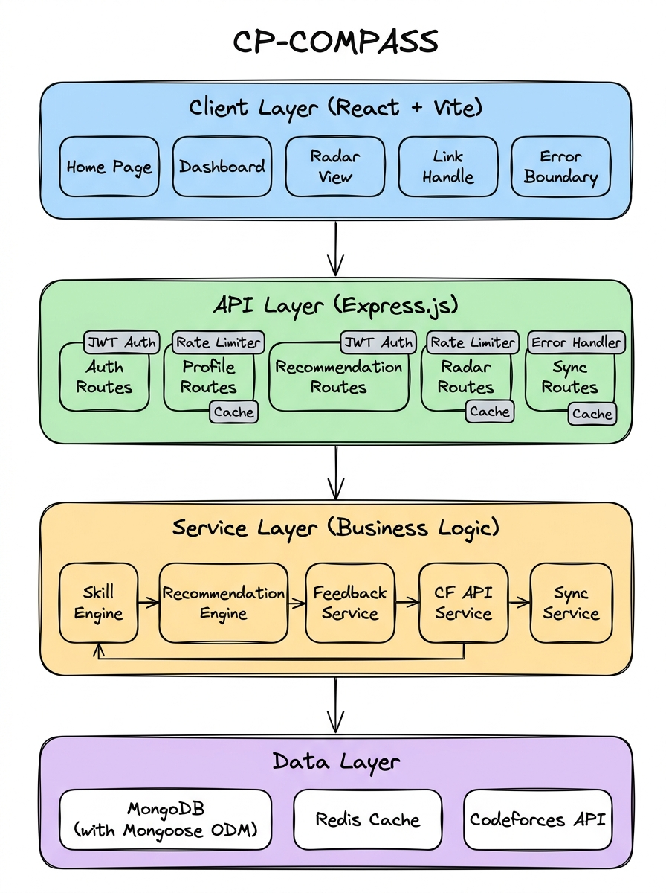

# CP-COMPASS

**A competitive programming skill analysis and problem recommendation engine that syncs your Codeforces profile, computes per-tag skill vectors with recency-weighted scoring, detects weaknesses using gap analysis, and recommends targeted practice problems with guided thinking prompts.**

CP-COMPASS does not randomly suggest problems. Instead, it pulls your full submission history from the Codeforces API, builds a weighted skill profile across every problem tag (dp, graphs, greedy, etc.), identifies where you are underperforming relative to your own global level, and recommends problems that specifically target those gaps. Each recommendation includes a difficulty-calibrated problem, an explanation of why it was chosen, and thinking prompts designed to guide you toward the solution without giving it away.

The system also provides a public Radar view — enter any Codeforces handle and get a complete skill breakdown without needing an account.

---

## Table of Contents

- [Architecture Overview](#architecture-overview)
- [The Recommendation Pipeline](#the-recommendation-pipeline)
  - [Step 1 — Codeforces Sync](#step-1--codeforces-sync)
  - [Step 2 — Skill Vector Computation](#step-2--skill-vector-computation)
  - [Step 3 — Weakness Detection](#step-3--weakness-detection)
  - [Step 4 — Problem Scoring and Selection](#step-4--problem-scoring-and-selection)
  - [Step 5 — Thinking Prompt Generation](#step-5--thinking-prompt-generation)
- [Feedback Loop](#feedback-loop)
- [Tag Relevance Filtering](#tag-relevance-filtering)
- [Caching Strategy](#caching-strategy)
- [Authentication](#authentication)
- [Data Models](#data-models)
- [Key Services and Components](#key-services-and-components)
- [Technology Stack](#technology-stack)
- [Project Structure](#project-structure)
- [Getting Started](#getting-started)

---

## Architecture Overview

CP-COMPASS is a full-stack application with a **React + Vite** frontend and a **Node.js / Express** backend, backed by **MongoDB** for persistent storage and **Redis** for caching. The backend communicates with the Codeforces API to pull submission data, processes it through a skill analysis and recommendation pipeline, and serves the results through a REST API.

The system follows a four-layer architecture:



The design is built around three ideas:

1. **Ground skill estimates in real submission data.** Ratings per tag are not guesses — they are weighted averages computed from every accepted submission, with recency decay and contest multipliers applied. A problem solved yesterday carries more weight than one solved six months ago.

2. **Separate the scoring model from the recommendation logic.** The skill engine computes what you are good and bad at. The recommendation engine uses those signals to search the full Codeforces problemset and score candidates. The feedback service watches for solved recommendations and triggers re-computation when enough new signal accumulates.

3. **Cache aggressively, degrade gracefully.** Every external API call and every computed profile is cached in Redis with tiered TTLs. If Redis goes down, the server continues running without caching — no crashes, just slower responses.

---

## The Recommendation Pipeline

### Step 1 — Codeforces Sync

When a user registers or triggers a manual sync, the system fetches up to 10,000 submissions from the Codeforces API (`user.status` endpoint) along with the user's profile info (`user.info`).

Submissions are filtered to keep only relevant verdicts — `OK`, `WRONG_ANSWER`, `TIME_LIMIT_EXCEEDED`, and `RUNTIME_ERROR`. These are bulk-written to MongoDB using `bulkWrite` with `$setOnInsert` to avoid duplicating submissions that were already synced previously.

After the sync completes, any new accepted submissions are passed to the feedback service to check if they match previously recommended problems.

### Step 2 — Skill Vector Computation

The skill engine processes all accepted submissions (with non-null problem ratings) and computes a per-tag skill estimate using recency-weighted averaging.

For each submission, two weights are applied:

- **Recency weight** — an exponential decay with a 90-day half-life. A problem solved today gets weight ~1.0, one solved 90 days ago gets ~0.5, and one from a year ago gets ~0.017. This prevents stale data from distorting current skill estimates.

- **Contest multiplier** — contest submissions get a 1.5x weight multiplier. Solving problems under time pressure is harder, so contest performance is a stronger signal.

Tags are processed through a relevance filter before being attributed (more on this below). The weighted sum and total weight per tag produce a per-tag estimated rating. Each tag also gets a confidence level based on sample size: `high` (20+ problems), `medium` (5-19), or `low` (below 5).

A global estimate is computed the same way across all submissions — this represents the user's overall estimated rating independent of tags.

### Step 3 — Weakness Detection

The engine compares each tag's estimated rating against the global estimate. A tag is flagged as a weakness if it meets either condition:

- **Absolute weakness** — the gap between global estimate and tag rating exceeds 150 points. If your global is 1400 and your DP rating is 1200, DP is an absolute weakness.
- **Relative weakness** — the tag is among the user's bottom three tags by rating, even if the gap is smaller than 150 points.

Weaknesses also get enriched with WA-rate data. The engine counts all wrong-answer submissions per tag and computes a WA ratio. A high WA rate on a tag suggests conceptual gaps, not just lack of practice.

### Step 4 — Problem Scoring and Selection

The recommendation engine takes the top 3 weaknesses and searches the full Codeforces problemset (cached in Redis, ~9000+ problems) for the best candidate per weakness.

Each candidate problem is scored using a composite function:

| Signal | Weight | How It Works |
|--------|--------|--------------|
| **Rating proximity** | 3x | Gaussian centered at `tagRating + 200`. Problems near the stretch target score highest. |
| **Freshness** | 1.5x | Higher contest IDs (more recent contests) score better. Avoids recommending very old problems. |
| **Popularity** | bonus | Problems solved by 1000+ users get +0.2, 5000+ get an additional +0.1. Popular problems tend to have better editorial coverage. |
| **Randomness** | small | A random factor (0.3-0.4) prevents the same problems from being recommended repeatedly. |

Problems the user has already solved are excluded. The same problem is never recommended for two different weakness slots in the same batch.

### Step 5 — Thinking Prompt Generation

Each recommended problem gets 2-3 thinking prompts that are tag-aware. Instead of giving hints about the specific problem, they guide the solver toward the right approach:

- **DP problems:** "What is the state? What does dp[i] represent?"
- **Graph problems:** "Is this directed or undirected? What traversal makes sense?"
- **Binary search:** "What are you binary searching on — a value or an answer?"
- **Greedy:** "What local choice leads to the global optimum? Can you prove it?"

All problems rated 1400+ also get an edge-case prompt. These prompts are generated algorithmically based on effective tags, not by an LLM.

---

## Feedback Loop

The feedback loop closes the gap between "we recommended a problem" and "the user actually solved it."

On every sync, the feedback service checks if any newly accepted submissions match problems from the user's active recommendation batches. When a match is found, it logs a `FeedbackEvent` with the problem ID, batch reference, number of attempts, and submission source (contest vs. practice).

If the total number of new accepted submissions since the last profile computation exceeds a threshold (default: 3), the feedback service triggers a full profile re-computation. This keeps the skill vector reasonably fresh without recomputing on every single submission.

Old recommendation batches are deactivated when new ones are generated — only the most recent batch is active.

---

## Tag Relevance Filtering

Not all problem tags are meaningful at all rating levels. Codeforces tags like `dp` or `graphs` on an 800-rated problem are often noise — the problem might technically use DP but it is really just a simple loop. Attributing that to a user's DP skill profile would dilute the signal.

CP-COMPASS implements a tag relevance filter with per-tag minimum rating thresholds:

| Tag | Minimum Rating |
|-----|---------------|
| `implementation`, `brute force`, `math`, `greedy`, `sortings` | 0 (always relevant) |
| `strings`, `data structures` | 800 |
| `combinatorics` | 800 |
| `binary search`, `two pointers` | 1100 |
| `dp`, `graphs`, `dfs and similar`, `trees` | 1200 |
| `bitmasks`, `hashing`, `games` | 1300 |
| `dsu`, `interactive` | 1400 |
| `geometry` | 1500 |
| `matrices`, `expression parsing` | 1600 |
| `flows`, `2-sat`, `string suffix structures` | 1700+ |
| `fft` | 1900 |

For problems rated 1600+, all tags are accepted regardless of the filter — at that level, tags are almost always intentional.

If the filter removes all tags from a problem, the original tags are kept as a fallback to avoid losing data entirely.

---

## Caching Strategy

CP-COMPASS uses Redis as a two-tier cache — both at the service level and at the middleware level.

**Service-level caching** handles expensive data:

| Cache Key | TTL | What It Stores |
|-----------|-----|----------------|
| `cf:user.status:{handle}` | 6 hours | Raw submission history from CF API |
| `cf:user.info:{handle}` | 6 hours | User profile from CF API |
| `cf:user.rating:{handle}` | 6 hours | Rating change history |
| `problemset:all` | 4 hours | Full Codeforces problemset with solve counts |
| `recommendations:{userId}` | 24 hours | Generated recommendation batch |

**Middleware-level caching** intercepts GET endpoints and caches the full JSON response:

| Endpoint | TTL | Key Pattern |
|----------|-----|-------------|
| `GET /profile/:handle` | 1 hour | `profile:{HANDLE}` |

Cache busting happens automatically — syncing a user clears their CF API cache, profile cache, and recommendation cache via pattern-based deletion (`SCAN` + `DEL`).

Redis is optional. The server detects connection failures at boot and degrades to running without caching. Reconnection is attempted with exponential backoff (up to 5 retries, max 3s delay). If Redis goes down mid-operation, individual get/set calls fail silently and log warnings.

---

## Authentication

CP-COMPASS supports two auth flows:

**Local auth** — email/password signup and login. Passwords are hashed with bcrypt (12 salt rounds). On signup, the user provides a Codeforces handle, which triggers an immediate sync and profile computation. JWT tokens are issued with a 30-day expiry.

**Google OAuth 2.0** — users sign in with Google via Passport.js. On first login, a User record is created with just the Google ID and email. Since there is no CF handle yet, the frontend redirects to a "Link Handle" page where the user enters their Codeforces handle. The handle is validated, synced, and linked to the existing User record.

If a Google user links a handle that already exists as an orphan User (created via the public register endpoint), the system merges the records — submissions and skill profiles are transferred to the Google-authenticated user, and the orphan is deleted.

All protected endpoints require a `Bearer` token in the Authorization header. The JWT middleware extracts `userId` and `handle` from the token payload.

---

## Data Models

### User
Stores the Codeforces handle, email, password hash (local auth) or Google ID (OAuth), avatar URL, auth provider, sync status, and last sync timestamp.

### Submission
A single Codeforces submission. Stores the CF submission ID (unique), problem ID, problem name, rating, tags, verdict, contest ID, whether it was a contest submission, and the submission timestamp. Indexed on `user_id`, `user_id + verdict`, and `problem_tags`.

### SkillProfile
The computed skill profile for a user. Contains the global estimated rating, a `tag_skills` map (each tag maps to a rating, confidence level, and sample size), a `weakness_vector` (sorted array of detected weaknesses with gap sizes and WA rates), the computation timestamp, and total submission count.

### Recommendation
A batch of recommended problems. Stores the user reference, the full batch array (each entry has the problem, target weakness, role, explanation, and thinking prompts), generation timestamp, validity window (24 hours), and active flag.

### FeedbackEvent
Logs when a user solves a recommended problem. Stores the problem ID, batch reference, outcome, number of attempts, and submission source (contest or practice).

---

## Key Services and Components

### Backend Services

| Service | What It Does |
|---------|-------------|
| `skillEngine.js` | Computes per-tag skill vectors with recency-weighted averaging, detects weaknesses using gap analysis, calculates WA rates, and persists the full profile |
| `recommendationEngine.js` | Fetches the full CF problemset, scores candidates against the user's weakness vector using a Gaussian + freshness + popularity model, generates thinking prompts |
| `feedback.js` | Tracks which recommended problems the user solved, logs feedback events, triggers profile re-computation when enough new signals accumulate |
| `cf.js` | Wrapper around the Codeforces API — submissions, user info, rating history. All calls are cached in Redis |
| `sync.js` (jobs) | Orchestrates the full sync flow — fetches submissions, bulk-writes to MongoDB, updates user status, triggers feedback processing |
| `BaseService.js` | Shared base class providing CF API base URL, timeouts, user lookup, handle normalization |

### Middleware

| Middleware | What It Does |
|-----------|-------------|
| `auth.js` | JWT verification — extracts userId and handle from Bearer token |
| `rateLimiter.js` | Tiered rate limiting backed by Redis (with in-memory fallback). Auth: 20/15min, API reads: 120/min, API writes: 20/15min, Recommendations: 15/15min |
| `cache.js` | Response-level caching middleware — intercepts `res.json()`, caches successful responses in Redis |
| `errorHandler.js` | Centralized error handling with environment-aware responses (dev: full stack trace, prod: sanitized messages) |

### Frontend Pages

| Page | What It Does |
|------|-------------|
| `Home` | Landing page with login/signup forms and public handle lookup |
| `Dashboard` | Authenticated user view — skill profile, weakness breakdown, recommendations with thinking prompts |
| `Radar` | Public skill analysis for any CF handle (no auth required) — accessible via `/radar/{handle}` |
| `LinkHandle` | Post-OAuth flow for linking a Codeforces handle to a Google account |
| `ErrorPage` | Handles connection errors, expired sessions, and server failures |

---

## Technology Stack

### Backend
- **Runtime:** Node.js with Express 5
- **Database:** MongoDB with Mongoose ODM
- **Caching:** Redis with tiered TTLs and graceful degradation
- **Authentication:** JWT (local) + Google OAuth 2.0 via Passport.js
- **Rate Limiting:** express-rate-limit with Redis store (rate-limit-redis)
- **External API:** Codeforces API (user.status, user.info, user.rating, problemset.problems)
- **Password Hashing:** bcryptjs (12 rounds)
- **Validation:** express-validator

### Frontend
- **Framework:** React 19 with Vite 8
- **Styling:** Vanilla CSS
- **Routing:** Client-side path-based routing (manual, no react-router)

---

## Project Structure

```
CP-COMPASS/
├── client/                              # React frontend (Vite)
│   ├── index.html                       # Entry HTML
│   └── src/
│       ├── api.js                       # API client — fetch wrappers, auth helpers
│       ├── App.jsx                      # Root component — routing, auth state
│       ├── components/
│       │   └── ErrorBoundary.jsx        # React error boundary
│       └── pages/
│           ├── Home.jsx / Home.css      # Landing page, login, signup
│           ├── Dashboard.jsx / .css     # Skill profile + recommendations
│           ├── Radar.jsx / Radar.css    # Public skill radar view
│           ├── LinkHandle.jsx / .css    # Post-OAuth handle linking
│           └── ErrorPage.jsx / .css     # Error display
│
├── server/                              # Express backend
│   ├── .env                             # Environment variables
│   ├── package.json
│   └── src/
│       ├── app.js                       # Server entry — boot, middleware, routes
│       ├── config/
│       │   ├── db.js                    # MongoDB connection
│       │   ├── redis.js                 # Redis client, cache helpers, TTL config
│       │   ├── passport.js              # Google OAuth strategy
│       │   └── tagRelevance.js          # Tag minimum rating thresholds
│       ├── controllers/
│       │   ├── auth.controller.js       # Signup, login, me
│       │   ├── oauth.controller.js      # Google callback, handle linking
│       │   ├── profile.controller.js    # Compute and fetch skill profiles
│       │   ├── recommendation.controller.js
│       │   ├── radar.controller.js      # Public skill radar
│       │   ├── sync.controller.js       # Manual sync trigger
│       │   └── user.controller.js       # Register, get user
│       ├── middleware/
│       │   ├── auth.js                  # JWT verification
│       │   ├── cache.js                 # Response caching middleware
│       │   ├── rateLimiter.js           # Tiered rate limiters
│       │   └── errorHandler.js          # Centralized error handling
│       ├── models/
│       │   ├── User.js
│       │   ├── Submission.js
│       │   ├── SkillProfile.js
│       │   ├── Recommendation.js
│       │   └── FeedbackEvent.js
│       ├── routes/
│       │   ├── index.js                 # Route aggregator
│       │   ├── auth.routes.js
│       │   ├── oauth.routes.js
│       │   ├── profile.routes.js
│       │   ├── recommendation.routes.js
│       │   ├── radar.routes.js
│       │   ├── sync.routes.js
│       │   └── user.routes.js
│       ├── services/
│       │   ├── BaseService.js           # Shared base class
│       │   ├── skillEngine.js           # Skill vector computation
│       │   ├── recommendationEngine.js  # Problem scoring + selection
│       │   ├── feedback.js              # Feedback loop
│       │   └── cf.js                    # Codeforces API wrapper
│       ├── jobs/
│       │   └── sync.js                  # Submission sync orchestrator
│       └── utils/
│           ├── AppError.js              # Custom error class
│           └── catchAsync.js            # Async error wrapper
│
└── docs/
    └── architecture.jpg                 # Layered architecture diagram
```

---

## Getting Started

### Prerequisites
- Node.js 18+
- MongoDB (local or Atlas)
- Redis (optional — server runs without it, just slower)
- A Codeforces account (for testing)
- Google OAuth credentials (optional — only needed for Google login)

### Environment Variables

Copy the example file and fill in your values:

```bash
cp server/.env.example server/.env
```

**Server (`server/.env`):**
```env
# Server
PORT=3000
NODE_ENV=development

# MongoDB
MONGODB_URI=mongodb+srv://<username>:<password>@cluster0.xxxxx.mongodb.net/?appName=Cluster0

# Redis (optional — server runs without it)
REDIS_URL=redis://localhost:6379

# Codeforces API
CF_API_BASE=https://codeforces.com/api

# JWT
JWT_SECRET=your_jwt_secret_here
JWT_EXPIRES_IN=30d

# Frontend URL (for CORS and OAuth redirects)
FRONTEND_BASE_URL=http://localhost:5173

# Google OAuth (optional — only needed for Google login)
GOOGLE_CLIENT_ID=your_google_client_id.apps.googleusercontent.com
GOOGLE_CLIENT_SECRET=your_google_client_secret
GOOGLE_CALLBACK_URL=http://localhost:3000/auth/google/callback
```

Only `MONGODB_URI`, `CF_API_BASE`, and `JWT_SECRET` are strictly required. Redis and Google OAuth are optional — the server gracefully degrades without them.

### Installation

```bash
# Clone the repo
git clone https://github.com/your-username/CP-COMPASS.git
cd CP-COMPASS

# Install server dependencies
cd server && npm install

# Install client dependencies
cd ../client && npm install
```

### Running

```bash
# Start the backend
cd server && npm run dev

# Start the frontend (separate terminal)
cd client && npm run dev
```

The backend runs on `http://localhost:3000` and the frontend on `http://localhost:5173`.

---

## License

This project is private and not currently licensed for distribution.
